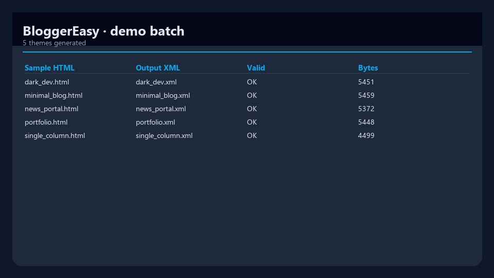
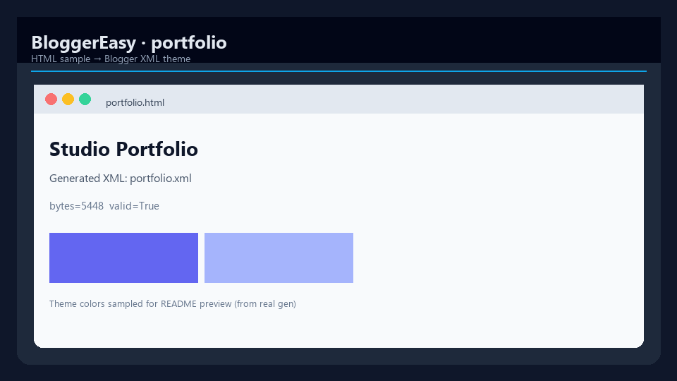
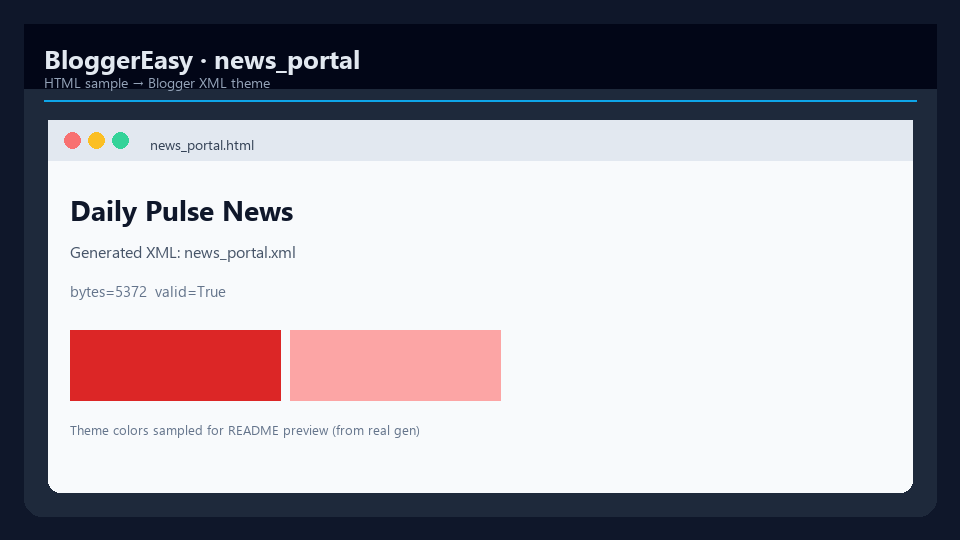
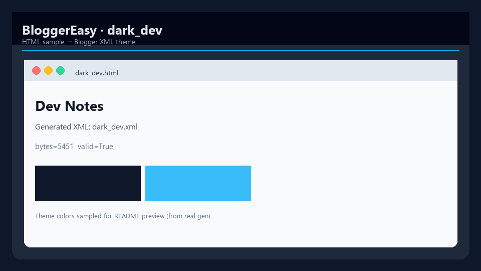
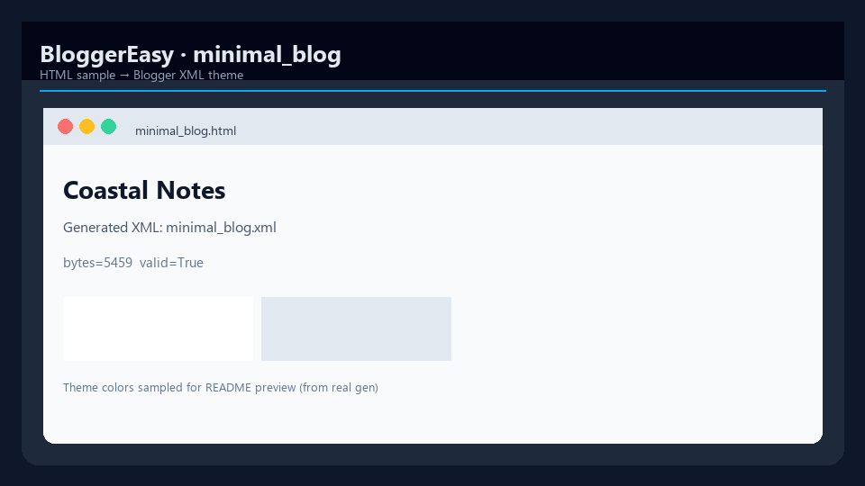
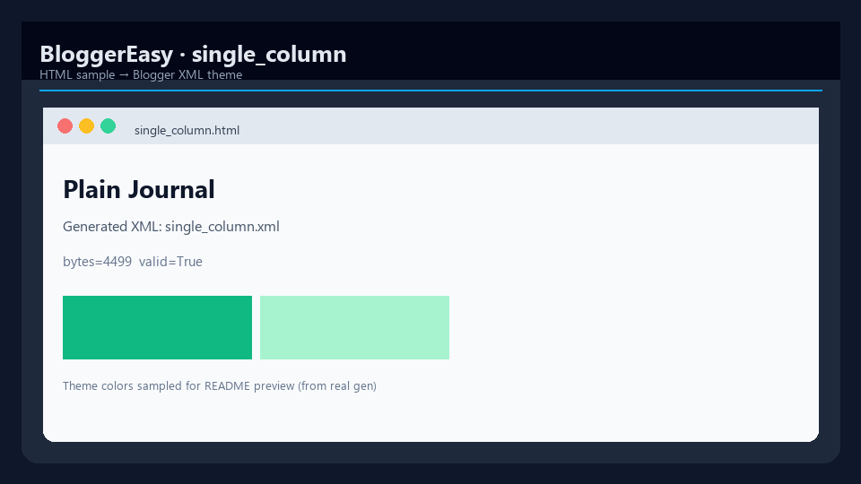

# BloggerEasy

[](https://www.python.org/downloads/)
[](pyproject.toml)
[](LICENSE)
[](https://github.com/mergeos-bounties)

**BloggerEasy** converts HTML pages into **importable Blogger XML themes** — layout, CSS, sections, and widgets ready for Blogger → Theme → Backup/Restore → Upload.

**Product:** [mergeos-bounties/BloggerEasy](https://github.com/mergeos-bounties/BloggerEasy)

---

## Table of contents

- [Highlights](#highlights)
- [Screenshots](#screenshots)
- [Quick start](#quick-start)
- [CLI reference](#cli-reference)
- [Templates & samples](#templates--samples)
- [Diagrams](#diagrams)
- [Repository layout](#repository-layout)
- [Development](#development)
- [MergeOS bounties](#mergeos-bounties)
- [License](#license)

---

## Highlights

| Capability | Description |
| --- | --- |
| **HTML → theme** | Parse local HTML samples into validated Blogger XML |
| **Templates** | Built-in presets: `simple`, `portfolio`, `news`, `dark`, … |
| **Batch demo** | `bloggereasy demo` generates themes for every sample |
| **Validate** | Check theme structure before upload |
| **Optional API** | Thin FastAPI for integrations (`bloggereasy serve`) |

---

## Screenshots

Real captures from the offline demo generator.

| Batch | Portfolio | News |
| :---: | :---: | :---: |
|  |  |  |
| *Demo batch table* | *Portfolio sample* | *News portal* |

| Dark dev | Minimal | Single column |
| :---: | :---: | :---: |
|  |  |  |
| *Dark developer theme* | *Minimal blog* | *Single column* |

---

## Quick start

```powershell
cd BloggerEasy
python -m venv .venv
.\.venv\Scripts\activate   # macOS/Linux: source .venv/bin/activate
pip install -e ".[dev]"

bloggereasy version
bloggereasy demo
bloggereasy templates list
```

Import any XML under `data/out/demo/` (or configured `OUT_DIR`) in Blogger → Theme → Backup/Restore → Upload.

---

## CLI reference

| Command | Purpose |
| --- | --- |
| `bloggereasy version` | Version + template names |
| `bloggereasy demo` | Generate themes for all `data/samples/html/*.html` |
| `bloggereasy templates list` | Built-in + file templates |
| `bloggereasy parse html -i <file>` | Parse HTML structure JSON |
| `bloggereasy gen html -i <file> -t <template>` | Generate one theme XML |
| `bloggereasy validate` | Validate theme files |
| `bloggereasy serve` | Optional API server |

```powershell
bloggereasy gen html -i data/samples/html/portfolio.html -t portfolio
bloggereasy demo -o data/out/demo
```

---

## Templates & samples

| Sample HTML | Suggested template |
| --- | --- |
| `portfolio.html` | `portfolio` |
| `news_portal.html` | `news` |
| `dark_dev.html` | `dark` |
| `minimal_blog.html` / `single_column.html` | `simple` |

Samples live in `data/samples/html/`. Prefer official/public page structure when scraping; respect site Terms of Service.

---

## Diagrams

System architecture and workflow — full width. Open the HTML files for **dark/light theme** and export (PNG/SVG).

### Architecture

[Open interactive diagram](docs/diagrams/architecture.html)

<p align="center">
  
</p>

### Workflow

[Open interactive diagram](docs/diagrams/workflow.html)

<p align="center">
  
</p>

*Generated with [archify](https://github.com/tt-a1i).*

---

## Repository layout

```text
src/bloggereasy/
  cli.py              # Typer CLI
  parse/html_page.py  # HTML structure
  theme/builder.py    # Blogger XML generation
  theme/presets.py    # Template registry
  theme/validate.py   # Validation
  integrations/sdk.py # HTML / URL / image entrypoints
data/samples/html/    # Demo pages
docs/screenshots/     # README gallery
docs/diagrams/        # Architecture + workflow
```

---

## Development

```powershell
pytest -q
ruff check src tests
bloggereasy demo
```

---

## MergeOS bounties

1. Star this repo + [mergeos](https://github.com/mergeos-bounties/mergeos)
2. Claim a `bounty` issue · Claim Token [mergeos#1](https://github.com/mergeos-bounties/mergeos/issues/1)
3. PR to **master** with tests / theme XML evidence
4. MRG credit **25 / 50 / 100 / 200** after merge

See [docs/BOUNTY.md](docs/BOUNTY.md) if present.

---

## Tiếng Việt

**BloggerEasy** tạo theme XML Blogger từ HTML mẫu (offline). Chạy `bloggereasy demo` → upload XML trong Blogger Theme → Backup/Restore.

---

## License

MIT · MergeOS / ThanhTrucSolutions
